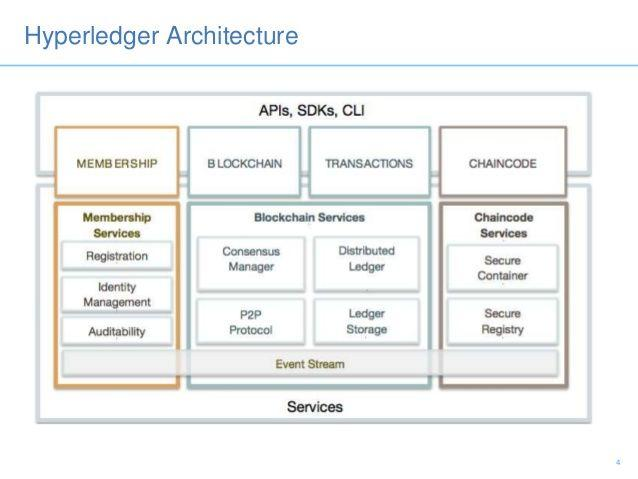
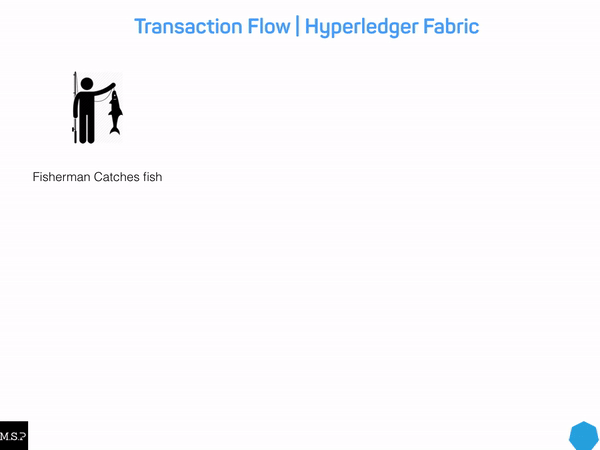
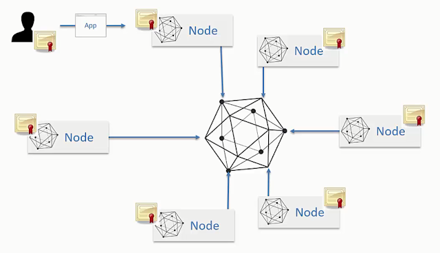
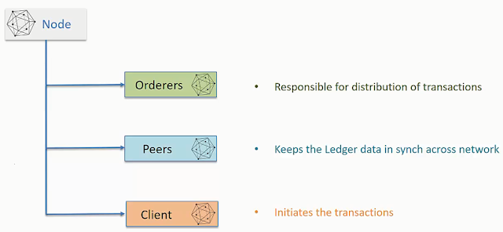
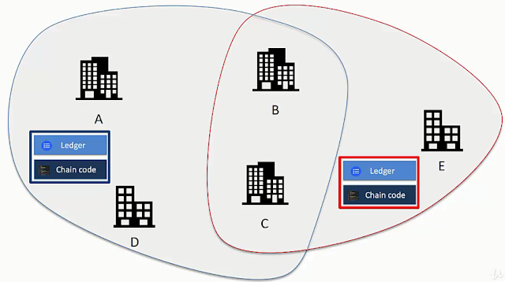

# Kiến trúc của Hyperledger

## Membership Services Provider (MSP)

Cung cấp các dịch vụ quản lý danh tính, quyền riêng tư, bảo mật và kiểm toán trên mạng. Membership service có nhiệm vụ quản lý các user đăng ký vào channel, chỉ có user đã được chấp thuận mới có thể truy cập vào mạng.

1 Hyperledger Fabric blockchain network có thể được quản lý bởi 1 hoặc nhiều MSP, phân ra thành **Channel MSP** và **Local MSP**.
Channel MSP nắm giữ chứng chỉ định danh cho toàn bộ các node tham gia vào Channel, trong khi Local MSP nắm giữ chứng chỉ định danh cho user thuộc về 1 node duy nhất.

Mỗi MSP nên có 1 tên định danh riêng để có thể tham chiếu vào mạng ( ví dụ *msp1*, *org2*, và *org3.divA*).

Có thể hiểu 1 MSP nắm giữ danh sách các user hợp lệ trong mạng đó, nó nắm giữ 1 "Chứng chỉ định danh" (Certificate Authority) cho các thành viên trong mạng lưới. Tuy nhiên trên thực tế, chỉ có chứng chỉ của Administrator là được cấu hình trên MSP, các thành viên còn lại sẽ được xác thực theo thuật toán **standard x509 PKI validation**, trong khi Administrator được xác thực theo thuật toán so khớp byte-to-byte (**byte-to-byte comparision**)

## Chaincode

Hyperledger lưu các smartcontract dưới dạng các chaincode (ngôn ngữ lập trình để phát triển smartcontract), chaincode được sử dụng trong Hyperledger là Golang, Nodejs và Java. Có thể hiểu chaincode là một decentralize application, chạy trên các nút xác nhận hợp lệ và sử dụng được đóng gói trong các docker.

Chaincode có nhiệm vụ thực thi các logic code nhằm truy vấn hoặc cập nhật trạng thái của sổ cái. Trong Hypeldger Fabric, chaincode là "smart contract" chạy trên các peers và tạo ra các transactions trên sổ cái chia sẻ của mạng Hyperledger Fabric (Hyperledger Fabric network's shared  ledger), cập nhật trạng thái của asset trong mạng.

Lập trình viên dùng chaincode để viết các logic code, định nghĩa asset và quản lý chung các ứng dụng phi tập trung. Các ứng dụng này tương tác với sổ cái thông qua chaincode, vì vậy, chaincode phải được cài đặt trên toàn bộ các peer của channel.

## Blockchain Services

Các dịch vụ Blockchain bao gồm ba thành phần chính: giao thức peer-to-peer (P2P) dựa trên HTTP / 2, sổ kế toán phân phối và trình quản lý đồng thuận.

## Transactions

Các giao dịch được thực hiện và lưu trữ trên Blockchain.

## Node và channel

### Node

Các node trong Hyperledger tương tác với nhau thông qua mạng, mỗi node có certificate riêng để định danh node đó. Người dùng cũng tương tác với node thông qua application, sử dụng định danh riêng của mình để thực hiện việc tương tác này.

Các node trong Hyperledger là không ngang hàng. Có 3 loại node chính trong hệ thống, bao gồm:

- Client Nodes: Người dùng sử dụng để tạo ra giao dịch (transaction -txn)
- Peers: dùng để giữ cho dữ liệu đồng bộ trong toàn bộ hệ thống (do các node không ngang hàng nên cần có peers)
- Orderers: dùng để thực thi, phân phối các giao dịch trong hệ thống.

### Channel

- Peers kết nối đến channel
- Mỗi channel/nhánh trong Hyperledger Blockchain network sẽ có một sổ cái lưu trữ dữ liệu riêng.

