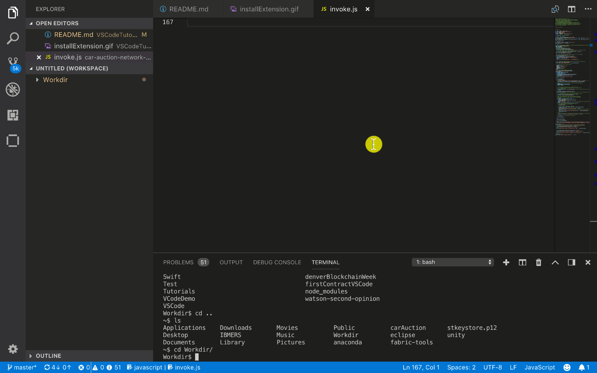
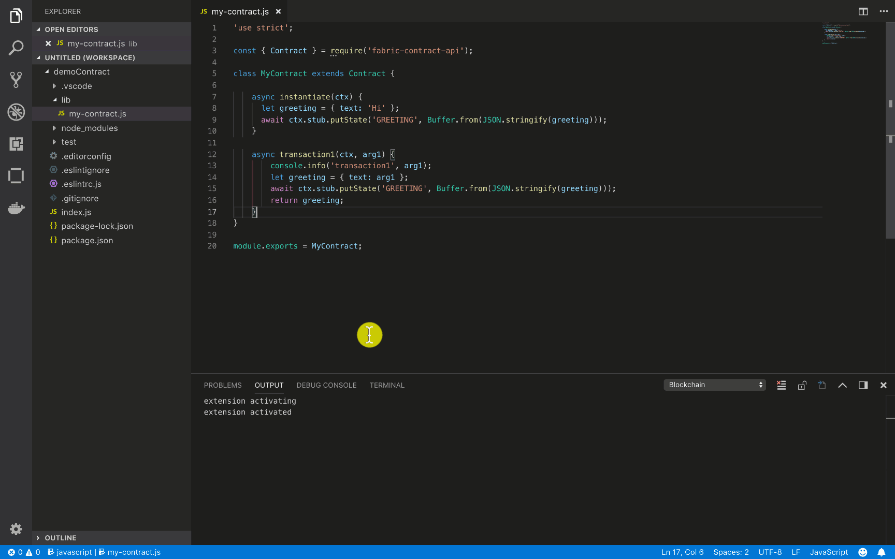
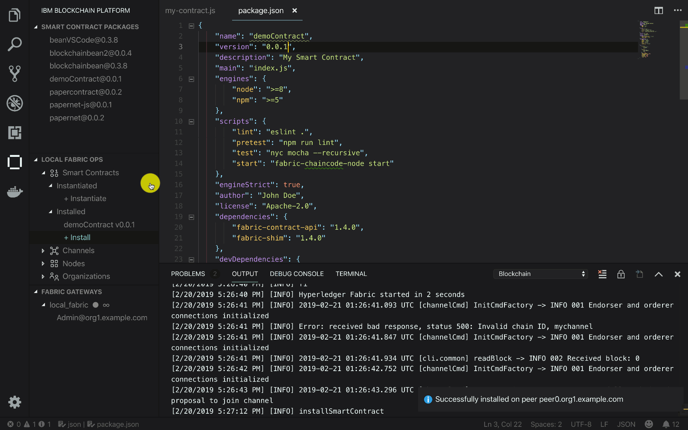
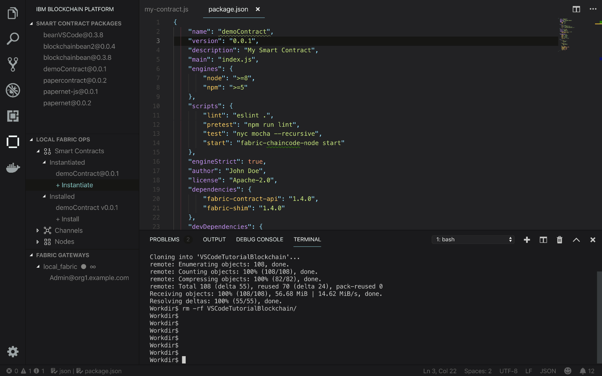
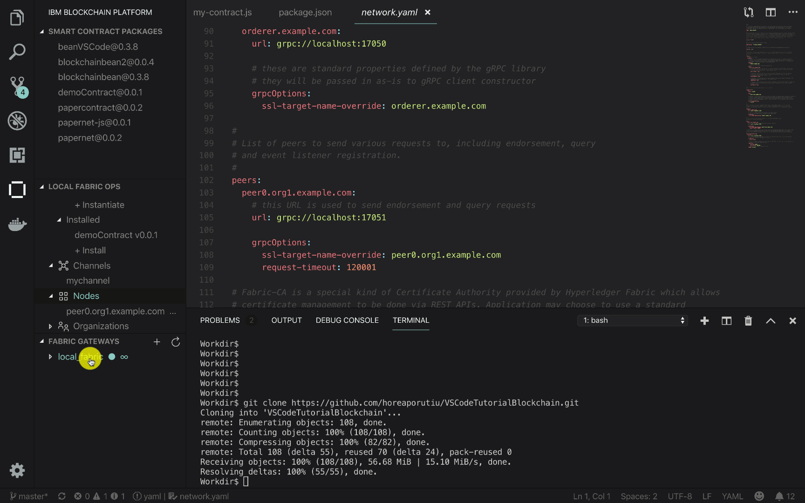
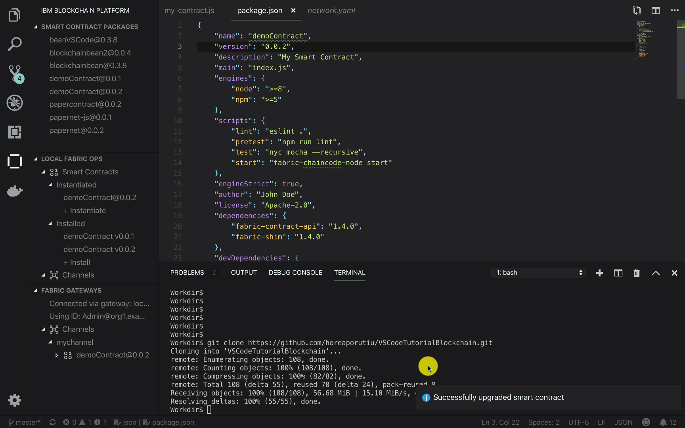

# Cài đặt Hyperledger Fabric

Bạn có thể xem hướng dẫn gốc [tại đây](https://developer.ibm.com/tutorials/ibm-blockchain-platform-vscode-smart-contract/)

## Bước 1: cài đặt extension


Đầu tiên, hãy chắc chắn bạn đang ở phiên bản Visual Code mới nhất, sau đó mở phần Extensions ở sidebar bên trái, bạn cũng có thể mở Extensions bằng phím tắt **Ctrl + Shif + X**.

Tìm kiếm extension **IBM Blockchain Platform** sau đó nhấn nút install để tiến hành cài đặt.

## Bước 2: Generate Smart contract Project


1. Mở cửa sổ gọi lệnh bằng phím tắt **Ctrl + Shif + P**, chọn **IBM Blockchain Platform: Create Smart Contract Project** từ khung gọi lệnh, bạn cũng có thể gõ trực tiếp IBM Blockchain... vào khung gọi lệnh để tìm kiếm nhanh các command.
2. Một cửa sổ tùy chọn hiện lện, ở đây tôi chọn Javascript là ngôn ngữ viết Smart Contract trong Project. Bạn có thể chọn Typescript nếu muốn. Tại thời điểm viết hướng dẫn này, IBM Blockchain Platform chỉ mới hỗ trợ Javascript và Typescript mà thôi.
3. Tại của sổ tiếp theo, bạn sẽ được hỏi về nơi lưu project, chọn **New Folder** để tạo thư mục mới hoặc chọn 1 thư mục có sẵn.
4. Cuối cùng, chọn **Add to workspace** để thêm project vào workspace hiện tại

## Bước 3: Chỉnh sửa smart contract


Mở file lib/my-contract.js, đây là file chứa nội dung smart contract đã tạo sẵn, chúng ta sẽ chỉnh sửa file này. Hãy thay đổi nội dung file lib/my-contract.js bằng đoạn code dưới đây:

```javascript
'use strict';

const { Contract } = require('fabric-contract-api');

class MyContract extends Contract {

  //update ledger with a greeting to show that the function was called
  async instantiate(ctx) {
    let greeting = { text: 'Instantiate was called!' };
    await ctx.stub.putState('GREETING', Buffer.from(JSON.stringify(greeting)));
  }

  //take argument and create a greeting object to be updated to the ledger
  async transaction1(ctx, arg1) {
    console.info('transaction1', arg1);
    let greeting = { text: arg1 };
    await ctx.stub.putState('GREETING', Buffer.from(JSON.stringify(greeting)));
    return JSON.stringify(greeting);
  }

}

module.exports = MyContract;
```

Ok, trong đoạn code trên có 2 functions chính:

* **instantiate** tạo 1 greeting object và lưu nó vào sổ cái với key GREETING
* **transaction1** nhận vào 2 tham số, ctx là 1 Hyperledger Fabric context, trong khi arg1 là nội dung của greeting object do người dùng nhập vào.

Phương thức ctx.stub.putState được dùng để ghi greeting object lên sổ cái.

## Bước 4: Đóng gói smart contract



Ở bước 3 bạn đã biết cách viết 1 smart contract đơn giản và các hàm cơ bản của nó, giờ hãy đóng gói và cài đặt lên peer.

1. Mở của sổ gọi lệnh bằng phím tắt **Ctrl + Shif + P**, chọn **IBM Blockchain Platform: Package a Smart Contract**
2. Sau khi smart contract đã đóng gói thành công, mở **IBM Blockchain Platform views** ở Activity Bar (bên trái). Bạn sẽ thấy `demoContract@0.0.1`

## Bước 5: Cài đặt smart contract


Ok bạn đã đóng gói thành công smart contract đầu tiên, giờ hãy cài đặt nó nào!

IBM Blockchain Platform đã cài đặt sẵn 1 network dùng làm môi trường phát triển, hàng chính chủ xịn xò nên yên tâm dùng nhé. Ngoài network có sẵn, extension cũng start sẵn một số docker container với các quyền khác nhau: Orderer, Certificate Authority, CouchDB, và Peer.

1. Giờ hãy mở IMB Blockchain Platform view từ Activity Bar, bạn sẽ thấy **LOCAL FABRIC OPS**, click vào biểu tượng 3 chấm và chọn **Start Fabric Runtime**.

    Extension sẽ cung cấp các docker containers đóng vai trò như các node trong mạng. Khi việc khởi chạy hoàn tất, bạn sẽ thấy **Smart Contract** bên dưới **LOCAL FABRIC OPS**.
2. Bên dưới tab **Smart Contract**, chọn **+ Install**
3. Extension sẽ hỏi bạn muốn cài đặt smart contract lên peer nào? Hãy chọn **peer0.org1.example.com**
4. Extension sẽ hỏi bạn muốn cài đặt package nào? Hãy chọn `demoContract@0.0.1`.
5. Quá trình cài đặt diễn ra hoàn tất, bạn sẽ thấy thông báo **Successfully installed on peer peer0.org1.example.com**

## Bước 6: Khởi chạy smart contract



Bạn đã học cách khởi tạo smart contract, đóng gói và cài đặt nó lên 1 peer, bây giờ hãy thử chạy nó.

1. Bên dưới tab **Smart Contract**, bạn sẽ thấy tab **Instantiated**, click vào **+ Instantiate**
2. Extension sẽ hỏi bạn khởi chạy smart contract trên channel nào?  hãy chọn **mychannel**.
3. Extension sẽ hỏi bạn muốn chạy smart contract và version nào? Hãy chọn `demoContract@0.0.1`.
4. Extension sẽ hỏi bạn muốn chạy function nào? gõ vào **instantiate** (bạn nhớ 1 trong 2 functions ở smart contract chứ?)
5. Vì function **instantiate** không nhận vào tham số nào, nên ở cửa sổ tiếp theo, hãy để trống và nhấn enter.
6. Sau khi khởi chạy hoàn tất, bạn sẽ thấy kết quả ở góc dưới bên phải :)

## Bước 7: Export connection details



Ở bước này chúng ta sẽ học cách export thông tin truy cập của mạng ra 1 ứng dụng bên ngoài.
1. Trước hết hãy clone project mẫu từ github sau, chúng ta sẽ export thông tin truy cập ra project này để dùng trong các bước sau:

    git clone https://github.com/horeaporutiu/VSCodeTutorialBlockchain.git

2. Thêm project vừa clone vào workspace bằng cách chuột phải vào **explore views** và chọn **Add folder to workspace**, tìm đến folder vừa clone về và chọn nó.
3. Click vào **IMB Blockchain Platform views**
4. Dưới tab **LOCAL FABRIC OPS**, click vào **Nodes**, click chuột phải vào **peer0.org1.example.com** node, chọn **Export Connection Details**
5. Extension sẽ hỏi muốn lưu connection profile vào đâu? Hãy chọn folder **VSCodeTutorialBlockchain**
6. Đợi extension export connection profile, bạn sẽ nhận được thông báo như sau nếu việc export thành công

    ```
    Successfully exported connection details to 
    /Users/Horea.Porutiu@ibm.com/Workdir/VSCodeTutorialBlockchain/local_fabric
    ```

## Bước 8: Submit transaction



Ở bước này, chúng ta sẽ học cách truy vấn vào mạng thông qua submit transaction bằng extension.

1. Bên dưới tab **LOCAL FABRIC OPS**, bạn sẽ thấy 1 khu vực gọi là **FABRIC GATEWAY**
2. Click vào **local_fabric**, sau đ1o click vào **Admin@org1.example.com**
3. Bạn sẽ thấy thông báo **Connecting to local_fabric**
4. Ok, dưới tab **Channels** trong **FABRIC GATEWAY**, bạn sẽ thấy **mychannel**, bấm vào phần mở rộng, bạn sẽ thấy **demoContract@0.0.1** và 2 function bên trong nó là **instantiate** và **transaction1**
5. Bấm chuột phải vào **transaction1** và click **Submit transaction**, ở phần nhập tham số, hãy nhập bất kỳ, ở đây mình nhập "hello".

Vậy là xong, bạn đã submit 1 transaction lên mạng Fabric và cập nhật sổ cái.

## Bước 9: Cập nhật smart contract


Chúng ta đã học cách tạo smart contract, cài đặt và truy vấn. Ở bước này chúng ta sẽ học cách update 1 smart contract có sẵn. Chúng ta cũng đã biết cách thêm dữ liệu vào sổ cái thông qua *ctx.stub.putState*, giờ chúng ta sẽ học cách lấy dữ liệu ra thông qua *ctx.stub.getState* API.

1. Cập nhật file my-contract.js, thay thế nội dung file my-contract.js bằng đoạn code sau:

```javascript

'use strict';

const { Contract } = require('fabric-contract-api');
class MyContract extends Contract {
//update ledger with a greeting 
async instantiate(ctx) {
let greeting = { text: 'Instantiate was called!' };
    await ctx.stub.putState('GREETING', Buffer.from(JSON.stringify(greeting)));
}
//add a member along with their email, name, address, and number
async addMember(ctx, email, name, address, phoneNumber) {
let member = {
    name: name,
    address: address,
    number: phoneNumber,
    email: email
};
await ctx.stub.putState(email, Buffer.from(JSON.stringify(member)));
    return JSON.stringify(member);
}
// look up data by key
async query(ctx, key) {
    console.info('querying for key: ' + key  );
    let returnAsBytes = await ctx.stub.getState(key);
    let result = JSON.parse(returnAsBytes);
        return JSON.stringify(result);
    }
}
module.exports = MyContract;
```

- `addMember`: thêm dữ liệu vào ledger thông qua các tham số như email name, address, phoneNumber
- query: truy vấn ledger thông qua key. Trả về  dữ liệu nếu có.

2. Cập nhật lại version trong file `package.json`

    `"version": "0.0.2",`

3. Dưới tab **LOCAL FABRIC OPS**, phần **Instantiated**, bạn sẽ thấy **demoContract@0.0.1**, bấm chuột phải vào nó và chọn **Upgrade smart contract**
   
4. Extension sẽ hỏi bạn muốn chọn phiên bản nào để cập nhật, hãy chọn **demoContract**
   
5. Extention sẽ hỏi bạn muốn cài đặt smart contract mới vào peer nào, hãy chọn **peer0.org1.example.com**
   
6. Extension sẽ hỏi bạn muốn gọi function nào, hãy nhập **instantiate**
   
7. `instantiate` không có tham số, vậy nên chúng ta sẽ để trống và nhấn enter. Việc upgrade sẽ diễn ra trong chốc lát, bạn sẽ nhận được thông báo **Successfully upgraded smart contract** khi upgrade hoàn tất.

## Bước 10: Submit thêm transaction



Bạn đã cập nhật xong smart contract, bên dưới khu vực **FABRIC GATEWAY** và tab **Channels**, trong **mychannel** bạn sẽ thấy **demoContract@0.0.2**.

1. Trong **demoContract@0.0.2**, bạn sẽ thấy các function `instantiate`, `addMember` và `query`
2. Chuột phải vào `addMember` và chọn **Submit Transaction**, nhập thông tin sau vào phần **arguments**

`ginny@ibm.com, Ginny Rometty, Wall Street NY, 1234567890`

Bạn cũng có thể tự nhập vào các tham số của mình, mỗi tham số cách nhau bởi dấu phẩy như trên.

Hãy add thêm 3 hoặc 4 member nữa để có thể truy vấn ở bước sau.

## Bước 11: Truy vấn vào sổ cái


Bạn đã hoàn tất ghi dữ liệu vào sổ cái, giờ là lúc xem những thông tin chúng ta đã ghi vào. Chúng ta sẽ dùng thư mục **VSCodeTutorialBlockchain** đã clone trước đó.

1. Trong file **query.js**, nội dung của nó hoàn toàn giống với **invoke.js** ngoại trừ dòng sau:
```javascript
// query.js
// this function just query the ledger, not update it
let response = await contract.evaluateTransaction('query', 'GREETING');

// invoke.js
// this function will update the ledger state
let response = await contract.submitTransaction('instantiate');
```
Phần quan trọng đây: `evaluateTransaction` sẽ **không submit transaction vào ordering service**, do đó nó không cập nhật lại dữ liệu trong sổ cái. Trong file **invoke.js**, bạn submit transaction lên ordering service, việc này **ghi dữ liệu vào trong sổ cái**, còn ở **query.js** thì ngược lại, dữ liệu sẽ không được cập nhật vào sổ cái.

2. Dùng terminal có sẵn trong VS code hoặc bất kỳ trình terminal khác, cd vào thư mục **VSCodeTutorialBlockchain**, cài đặt những dependencies cần thiết bằng lệnh sau:

```
    VSCodeTutorialBlockchain$ npm install
```

3. Sau khi hoàn tất việc cài đặt các dependencies cần thiết, chúng ta sẽ chạy thử file query.js
    
```
    VSCodeTutorialBlockchain$ node query.js
```

Output:
    
```
    Connected to Fabric gateway.
    { text: 'Instantiate was called!' }
    Disconnect from Fabric gateway.
    done
```
Bạn nhớ **demoContract@0.0.1** chứ? đây chính là dữ liệu đã ghi vào sổ cái ở version 0.0.1
   
4. OK, giờ hãy thử thay đổi file query.js một chút, từ thế này

```javascript
let response = await contract.evaluateTransaction('query', 'GREETING');
```

thành thế này:

```javascript
let response = await contract.evaluateTransaction('query', 'ginny@ibm.com');
```

Bạn có đoán được ý nghĩa của đoạn code này không?

Kết quả sẽ ra thế này:

```
    VSCodeTutorialBlockchain$ node query.js
    Connected to Fabric gateway.
    {"address":" Wall Street NY","email":"ginny@ibm.com","name":" Ginny Rometty","number":" 1234567890"}
    Disconnect from Fabric gateway.
    done
```

5. Thử thay đổi nội dung request thành email nào đó bạn đã nhập ở bước trên, lets try and see the magic!

## Bước 12: Test the contract


Chúng ta cũng có thể test smart contract ngay trong IBM Blockchain Platform extension. Bấm vào icon IBM Blockchain Platform ở bên trái.

1. Dưới khu vực **FABRIC GATEWAY**, trong tab **Channels**, bạn sẽ thấy **mychannel**, click vào smart contract mới nhất `demoContract@0.0.2` và chọn **Generate Smart Contract Tests**.
2. Chọn ngôn ngữ để generate test, ở đây mình chọn Javascript.
3. Khi hoàn tất, bạn có thể chạy npm test từ thư mục **demoContract**, hoặc click vào **run test** button từ **VSCode UI** như gif.


## Tổng kết

Done, chúng ta đã học được cách tạo, đóng gói, cài đặt smart contract lên mạng Fabric, khởi tạo và gọi Smart contract function bằng Hyperledger API. Từ giờ bạn có thể modify file my-contract.js và tạo ra smart contract riêng của mình.

Mình có tạo 1 smart contract sample từ tutorial này [tại đây](https://github.com/1212087/fabric-sample), bạn có thể chạy nó sau khi hoàn tất tutorial này.