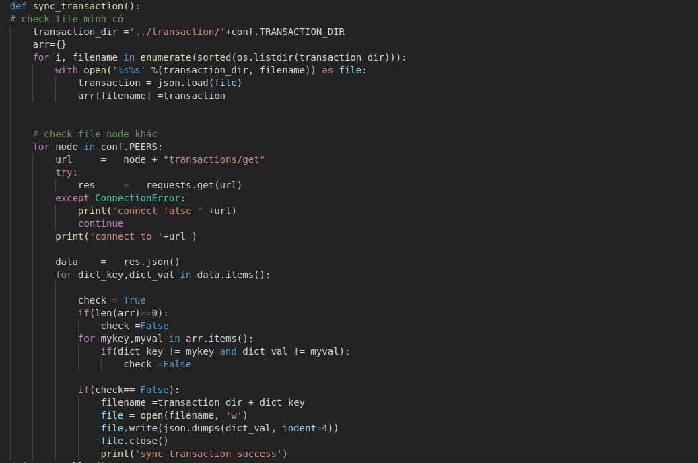
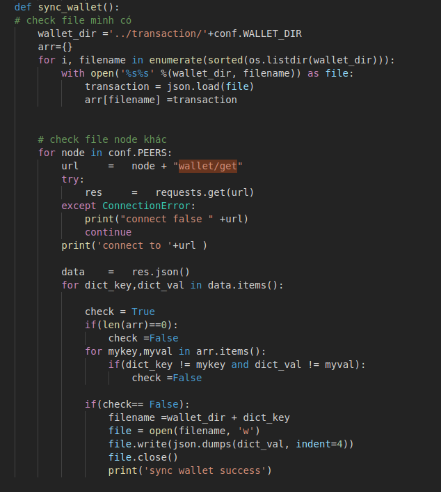
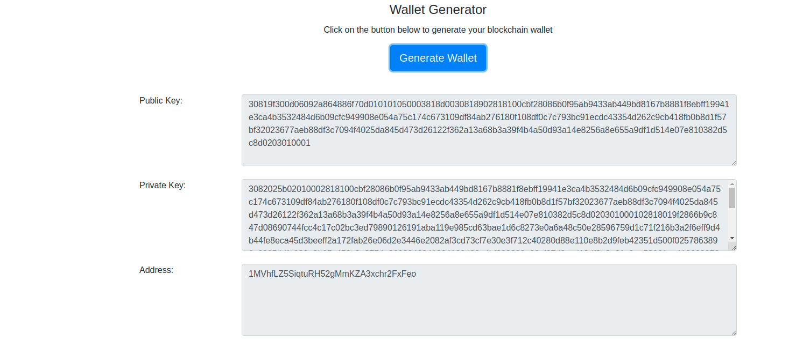
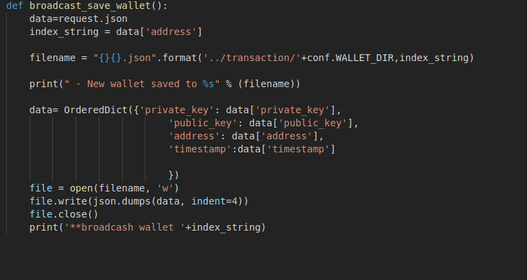
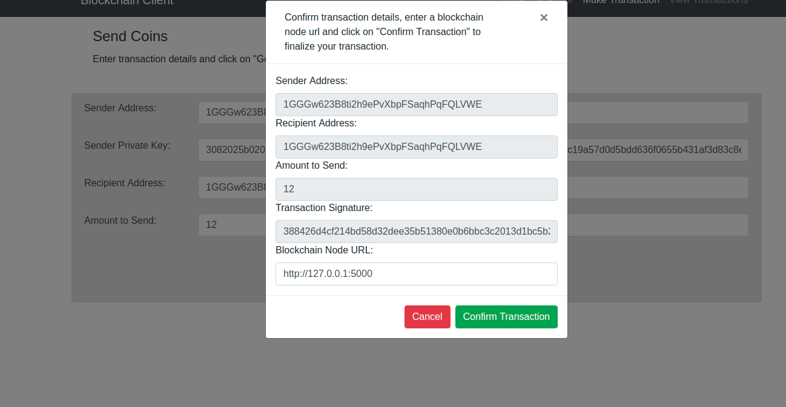
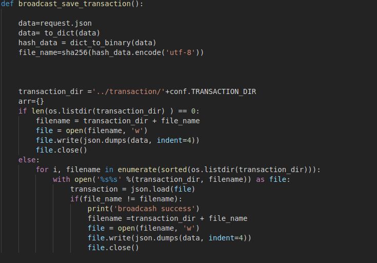

# Chào mừng đến Blockchain

Sau đây là các bước cái đặt cho mạng blockchain 

## Cài đặt

* `git clone https://github.com/1212087/blockchain-python-tutorial` - Kéo dự án từ git.
* `mkdir server/chaindata` - Tạo folder chaindata.
* `mkdir transaction/transaction_wait` - Tạo folder transaciton_wait.
* `pip install flask` - Cài đặt thư viện flask .
* `pip install flask_cors` - Cài đặt thư viện flask_cors. 
* `pip install pycryptodome` - Cài đặt thư viện pycryptodome.
* `pip install base58` - Cài đặt thư viện base58.
* `pip install apscheduler` - Cài đặt thư viện apscheduler.

## Transaction
Transaction là giao dịch chuyển đổi từ bên A sang bên B , Giao dịch có thể bao gồm contract, chữ ký, tiền ảo.
 

### Đặc điểm 

* `Broadcast` - Giúp các note có thể đảy dữ liệu mới cho các note khác .
* `Sync` - Giúp note mới tạo có thể kéo đầy đủ dữ liệu mới về .
* `Private key` - Tạo ra khóa chính cho 1 ví, tượng trưng 1 người sử dụng, Private key không thể cho mọi người biết .
* `Public key` - Khóa công khai được tạo ra từ khóa chính, Public key có thể  cho mọi người biết .
* `Address` - Là địa chỉ của ví, đóng vai trò cần có để thực thiện giao dịch. 

### Sync
    Khi mốt máy tính muốn tham gia mạng blockchain thì cần phải được đồng bộ dữ liệu
    với tất cả máy tính trong mạng (note). Note sẽ thực hiện quá trình kéo dữ liệu 
    các note xung quanh và so sanh với chính mình và so sánh để lấy kết quá giống nhiều 
    nhất
### Broadcast
    Khi một giao dịch được thêm vào hàng đợi trước khi vào block, note sẽ tự động đẩy 
    dữ liệu sang các note khác .
### Wallet 
    Wallet được tạo ra bao gồm các thành phần: 
* Private key
* Public key
* Address

##Code
    Quy trình chạy transaction:
    Khi 1 note mới bắt đầu tham gia blockchain, sẽ bắt đầu gọi vào hàm sync transaction.
    Kiểm trasaction note mình, gọi qua những node khác kiếm transaction chưa có và thêm
    vào node mình.

    Đối với wallet củng vậy, gọi qua note khác lấy những wallet mới về

    Khi generate wallet, Note sẽ tạo địa chỉ ví 
    mới đồng thời thực hiện broadcast báo có địa chỉ mới cho những note xung quanh lưu lại.

    Khi generate transaction, Note sẽ tạo giao dịch 
    mới đồng thời thực hiện broadcast báo có giao dịch mới cho những note xung quanh lưu lại.

